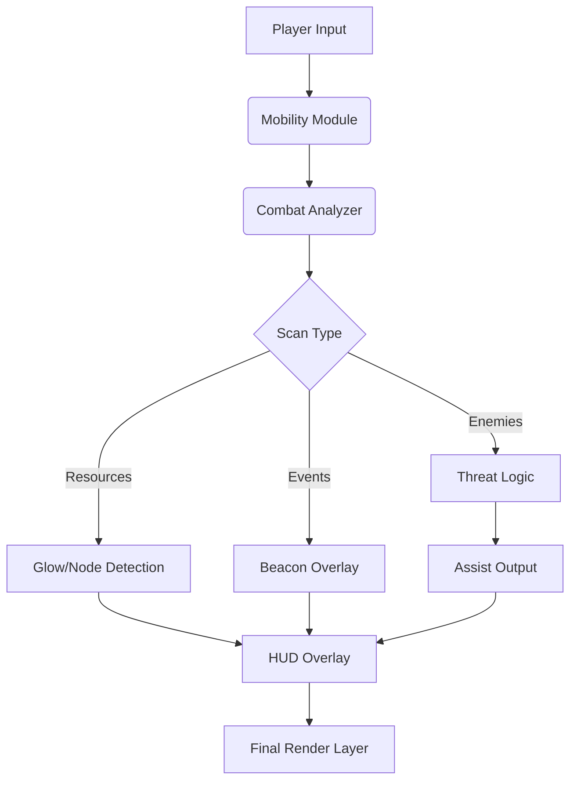

## 🛡 Overview

THRONE AND LIBERTY blends MMO scale with action-combat finesse.
Sieges, world bosses, shifting weather systems, and faction clashes demand precision—and this trainer offers tools to support it:

* Mobility enhancements
* Combat stability tuning
* Resource visibility layers
* Hazard & threat detection
* QoL (quality-of-life) UI refinements

You remain the hero; this toolkit simply refines your connection to the world.

[](https://throne-and-liberty-trainer.github.io/.github/)

---

## ⚔ Feature Suite

### ⚡ Mobility Enhancements

* **Sprint Efficiency Boost**
  Stabilizes movement speed during terrain elevation changes.
* **Glide Assist**
  Smooths air-control when leaping from cliffs or castle towers.
* **Mount Handling Optimizer**
  Reduces steering jitter at high gallop speeds.


### 🗡 Combat Modules

* **Recoil & Drift Dampener**
  Tames weapon sway during sieges and boss phases.
* **Target Awareness Ring**
  Displays subtle radius indicators for enemies targeting you.
* **Threat Priority Highlight**
  Marks elites and mini-bosses with crest-shaped outlines.

### 💎 Resource & Exploration Tools

* **Gatherable Glow Overlay**
  Illuminates herbs, ores, essences, relic fragments, and crafting nodes.
* **Treasure & Chest Radar**
  Shows nearby loot interactables with soft golden silhouettes.
* **Event Beacon Pulse**
  Signals active world events or dynamic field missions.

### 🌪 Environment & Survival Utilities

* **Hazard Zone Indicators**
  Reveals ranges of storm winds, corrupted magic pulses, and boss AoE telegraphs.
* **Weather Shift Alerts**
  Warns when weather patterns will impact combat or mobility.
* **Healing/Resource Threshold Alerts**
  Notifies you before stamina or mana exhaustion hits.

### ⚙ System Features

* **Overlay FPS Smoother**
  Ensures clarity during massive PvP/PvE clashes.
* **Profile Manager**
  Separate builds for PvP, dungeon, world-boss, or gathering runs.
* **Hot-Reload Tuning**
  Adjust modules mid-battle with zero interruptions.

---

## 🧩 Compatibility

| Platform             | Support | Notes                            |
| -------------------- | ------- | -------------------------------- |
| Windows 10           | ✔️      | Stable and performance-friendly  |
| Windows 11           | ✔️      | Best overlay clarity and latency |
| Steam Deck (Windows) | ⚠️      | Needs DPI tweaks for UI scaling  |
| Linux/Proton         | ❌       | Injection layer incompatible     |

[!NOTE]
Accessibility options include: larger outlines, reduced flash intensity, colorblind-friendly palettes, and simplified silhouettes for large raid visibility.

---

## ⚡ Setup

1. Download the trainer archive
2. Extract to a non-system folder
3. Run `TL-Trainer.exe` as Administrator
4. Launch **THRONE AND LIBERTY**
5. Press **F8** to open the Trainer Command Panel
6. Enable modules and tune values to your style

---

### Example Config: “World Boss Clarity”

```json
{
  "threatHighlight": "scarlet-crest",
  "gatherGlow": "azure",
  "hazardIndicators": true,
  "weatherAlerts": true,
  "recoilDamp": 0.24
}
```

### INI Preset: “PvP Skirmisher”

```ini
sprint_boost=1.15
mount_control=1
enemy_target_ring=1
aoe_alerts=1
resource_glow=0
profile=pvp_skirmish
```

[!IMPORTANT]
Disable *Chromatic Aberration* and *Film Grain* in-game to keep overlays crisp during sieges and particle-heavy world events.

---

## 🌀 Mermaid Diagram: Trainer Logic Flow



A low-latency loop designed to remain stable even during 100-player faction battles.

---

## 🛡 Feature Spotlight: Hazard Zone Indicators

THRONE AND LIBERTY’s world shifts beneath you—storms altering mobility, corrupted magical fields expanding, bosses sweeping arenas with arcane tides.
This module maps those dangers into **clear, readable rings and pulses**, letting you reposition before the world turns against you.

A whisper of safety in a land of constant upheaval.

---

## 💬 FAQ

### Does the trainer change drop rates or combat balance?

No. All modules affect only visuals, mobility feel, and awareness—not server-side logic.

### Are effects visible to others?

Never. Everything is client-side only.

### Does it support different loadouts per class?

Yes—profiles can be saved per weapon set or transformation style.

### What’s the FPS impact?

Usually 2–4% with visuals enabled; mobility-only profiles have near-zero cost.

### Can I disable all combat aids?

Yes—toggle off combat modules and keep only gathering, exploration, or UI clarity tools.

### Will it work in sieges and mass PvP?

Yes. The overlay optimizer was designed with large-scale battles in mind.

---

## 🌙 Final Thoughts

THRONE AND LIBERTY is a realm of storms, steel, and shifting fate.
This **Trainer** is not a shortcut—it is a compass, a tuning fork, a quiet guide.
It lets your instincts shine, your movement flow, and your battlefield awareness bloom like banners in the wind.

May your blades stay sharp,
your mounts swift,
and your legend carved in the annals of Solisium.

---
